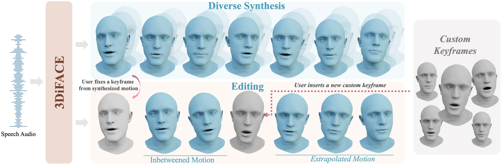

# 3DiFACE: Synthesizing and Editing Holistic 3D Facial Animation

[**3DiFACE-webpage**](https://balamuruganthambiraja.github.io/3DiFACE/)<br/>
[Balamurugan Thambiraja](https://balamuruganthambiraja.github.io/),
[Malte Prinzler](https://malteprinzler.github.io/),
[Sadegh Aliakbarian](https://sadegh-aa.github.io/),
[Darren Cosker](https://www.microsoft.com/en-us/research/people/coskerdarren/),
[Justus Thies](https://justusthies.github.io/)<br/>


[arXiv](http://arxiv.org/abs/2312.00870) | [BibTeX](#bibtex) | [Project Page](https://balamuruganthambiraja.github.io/3DiFACE/)

## Environment Setup

To get started with the 3D Face Animation Model, follow these steps to set up your development environment.

### Clone the Repository
First, clone the project repository to your local machine:

```bash
https://github.com/bala1144/3DiFACE.git
cd 3DiFACE
```

### Setup up the environment and pre-trained models
The project uses a dedicated Conda environment to manage dependencies.

1.  **Create the Conda Environment:**
    Execute the provided script to create and configure the `mdm38` Conda environment:
    ```bash
    bash ./create_env.sh
    ```
    This script will create a Conda environment named `mdm38` based on the `env38.yml` file, which specifies the necessary Python version and core dependencies. 

2.  **Download the assest:**
    After creation, activate the environment:
    ```bash
    bash ./download_assest.sh
    ```

3.  **Activate the Environment:**
    ```bash
    conda activate mdm38
    ```
4.  **Dataset preparation for running demo**:
    * Download wav2vec model, for example wav2vec2-base-960h from HuggingFace.
    * Process VOCASET using the steps in [Imitator](https://github.com/bala1144/Imitator) and [Faceformer](https://github.com/EvelynFan/FaceFormer)

5.  **Export the repo paths**:
    ```bash
    export PYTHONPATH=$PYTHONPATH:<path>/3DiFACE:<path>/3DiFACE/face_animation_model
    export VOCASET_PATH=<Path to vocaset folder>
    export WAV2VEC_PATH=<Path to wav2vec model folder (e.g. wav2vec2-base-960h)>
    ```

## Usage

### Evaluation

To run the face animation evaluation using a pre-trained model, execute the following command:

```bash
python face_animation_model/evaluate/complete_face_animation/complete_syn_w_sty.py --audio_file assests/audio/01welcome.wav --device cuda
```

*   `--device cuda`: Specifies that the evaluation should run on a CUDA-enabled GPU. If you do not have a CUDA-enabled GPU, you might need to change this to `--device cpu` (though performance will be significantly slower).
*   **Configuration:** The evaluation can configured using `face_animation_model/evaluate/complete_face_animation/cfg/comp_syn.yaml`. Here are some key configurable options:
    *   **`head_motion_model`**:
        *   `model_path`: Path to the pre-trained head motion model (e.g., `pretrained_models/head_reg_16_ip_mp0_02_rd02_3D_stdnorm_waud_skip_vel_loss0010`).
        *   `model_ckpt`: Specific checkpoint file within the model path (e.g., `"model000100035"`).
    *   **`face_motion_model`**:
        *   `model_path`: Path to the pre-trained face motion model (e.g., `pretrained_models/sa_03_024_fo_ns18`).
        *   `model_ckpt`: Specific checkpoint file.
        *   `identity_for_testing`: The identity subject to use for testing (e.g., `"FaceTalk_170731_00024_TA"`).
        *   `condition_for_tesing`: The condition subject to use for testing.
        *   `use_voca_template_for_vis`: Boolean to use VOCA template for visualization.
        *   `guidance_scale`: Controls the influence of the conditional signal.
        *   `guidance_sampling`: Boolean to enable guidance sampling.
    *   **`synthensis_mode`**: Defines the operation mode, either `"generate"` for new animations or `"edit"` for modifying existing ones.
    *   **`exp_cfg` (Experiment Configuration)**:
        *   `method`: Specifies what to synthesize: `"both"` (head and face) or `"face"` (only face).
        *   `edit_part`: When `synthensis_mode` is `"edit"`, specifies which part to edit (e.g., `["head"]`, `["face"]`).
        *   `num_frames_per_sample`: Number of frames to generate per sample.
        *   `num_of_samples`: Number of samples to generate.
        *   `experiment_name`: Name for the current experiment.
        *   `render`: Boolean to enable rendering of the output video.
        *   `graph_vis`: Boolean to enable visualization of graphs.
        *   **`edit_config` (within `exp_cfg` for `synthensis_mode: "edit"`)**:
            *   `edit_file`: Path to the `.npy` file containing the animation data to be edited.
            *   `edit_mode`: The editing strategy: `"in_between"`, `"keyframe"`, or `"keyframe_swap"`.
            *   `key_frames_dict`: A list of tuples `[source_frame, target_frame]` for keyframe operations.

### Training (Basic Overview for now)

The project includes scripts for training the face animation model. For detailed training instructions and configuration options, please refer to the `face_animation_model/train/` directory. Key training scripts include:

*   `face_animation_model/train/training_loop.py`: The main training loop script.
*   `face_animation_model/train/train_from_cfg.py`: Script to initiate training from a configuration file.

## Project Structure

A high-level overview of the important directories and their contents:

*   `face_animation_model/`: Contains the core logic for the face animation model, including:
    *   `data/`: Data loading and preprocessing utilities.
    *   `diffusion/`: Implementation of diffusion models.
    *   `evaluate/`: Scripts and configurations for model evaluation.
    *   `model/`: Model architectures and components.
    *   `train/`: Training scripts and related configurations.
    *   `utils/`: General utility functions.
    *   `visualizer/`: Tools for visualizing animation results.
*   `FLAMEModel/`: Files related to the FLAME model, used for 3D face representation.
*   `pretrained_models/`: Stores pre-trained model checkpoints used for evaluation and inference.
*   `assests/`: Contains example audio files that can be used for testing or demonstration.
*   `create_env.sh`: A shell script to automate the Conda environment setup.
*   `env38.yml`: The Conda environment definition file, listing all required packages.
*   `readme.md`: This documentation file.

## Pre-trained Models

The `pretrained_models/` directory contains various checkpoints. Each subdirectory typically includes:

*   `args.yml`: Configuration arguments used during the model's training.
*   `checkpoints/`: The actual model checkpoint files (e.g., `.pt` files).

To use a specific pre-trained model, ensure its path is correctly referenced in your evaluation or inference configuration (e.g., in `comp_syn.yaml`).

### Available Models:
*   `cond_012_17_00_concat_prob10_vel10/`: Generalized face-motion model [predicts voca face vertices]
*   `sa_03_024_fo_ns18/`: Personalized face-motion model for VOCA test identity '024'
*   `sa_03_138_fo_ns18/`: Personalized face-motion model for VOCA test identity '138'
*   `head_reg_14_kf_mp0_02_rd02_3D_stdnorm_waud_skip_vel_loss0010/`: Head motion model trained for motion key-framing.
*   `head_reg_16_ip_mp0_02_rd02_3D_stdnorm_waud_skip_vel_loss0010/`: Head motion model trained for in-painting.

## Contributing

We welcome contributions to the 3DiFace project! If you'd like to contribute, please follow these steps:

1.  Fork the repository.
2.  Create a new branch for your features or bug fixes.
3.  Make your changes and ensure they adhere to the project's coding standards.
4.  Submit a pull request with a clear description of your changes.

## BibTeX
```
 @inproceedings{
      thambiraja2025diface,
      title={3Di{FACE}: Synthesizing and Editing Holistic 3D Facial Animation},
      author={Balamurugan Thambiraja and Malte Prinzler and Sadegh Aliakbarian and Darren Cosker and Justus Thies},
      booktitle={International Conference on 3D Vision 2025},
      year={2025},
      url={https://openreview.net/forum?id=8qpjYG1x8I}
      }
  
```